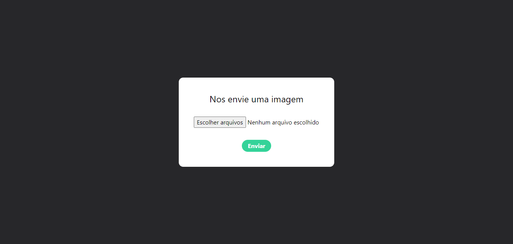

# Portfólio

Desenvolvi uma aplicação para upload de imagens. 

A página web foi inspirada em outras aplicações já existentes, adaptando seus designs e recursos. Utilizei tecnologias como TypeScript, React, MongoDB, TailwindCSS e CSS no desenvolvimento da aplicação.

[Link da aplicação back-end](https://github.com/pedroalima/API-img-x)

## Índice

- [Screenshots](#screenshots)
- [Objetivos](#objetivos)
- [Minha caminhada](#minha-caminhada)
  - [Propriedades e Tecnologias](#propriedades-e-tecnologias)
  - [Meu aprendizado](#meu-aprendizado)
- [Rodando o projeto](#rodando-o-projeto)
- [Autor](#autor)

</br>

## Screenshots



</br>

## Objetivos

O principal objetivo deste projeto foi praticar a manipulação de arquivos de imagens em formulários.

 Os usuários têm a capacidade de: 
- Armazenar arquivos de imagens na aplicação.

</br>

## Minha caminhada

- [x] Criação do servidor e conexão com banco de dados (MongoDB)
- [x] Configuração da biblioteca Multer e definições de rotas para adicionar, criar e deletar imagens no servidor
- [x] Deploy do servidor
- [x] Criação do layout e implementação dos serviços de adicionar, criar e deletar no front-end
- [x] Deploy do front-end

</br>

## Propriedades e Tecnologias

- TypeScript
- React
- Vite
- TailwindCSS
- CSS
- Node
- Express
- Mongoose
- MongoDB
- Multer
- CORS

</br>

  ## Meu aprendizado

Para trabalhar com upload de arquivos o express precisa de um middleware chamado Multer, que permite manipular dados multipart/form-data, que no pode ser definido aplicando a pripriedade "encType", na criação do formulário HTML.

```tsx
<form 
    onSubmit={handleUploadImage} 
    encType="multipart/form-data" 
    className="bg-white p-10 rounded-xl flex gap-8 flex-col justify-center items-center"
    >
...
</form>
```
  Em seguida basta criar as configurações que nomeiam e destinam o local do arquivo dentro do repositório.

```tsx
const multer = require("multer");
const path = require("path");

const storage = multer.diskStorage({
    destination: (req, file, cb) => {
        cb(null, "uploads/");
    },
    filename: (req, file, cb) => {
        cb(null, Date.now() + path.extname(file.originalname));
    }
});

const upload = multer({ storage });

module.exports = upload
```

Veja mais detalhes na [documentação oficial](https://github.com/expressjs/multer)
</br>

## Rodando o projeto

<!-- ### Acesse a [aplicação via web]() -->

#### Ou instale na sua máquina. Para conferir a versão final, é só realizar os seguintes passos:

### 1 - Clonando o Projeto:
Navegue até o diretório onde deseja clonar o projeto. Abra o terminal com o GitBash e execute o comando:

```bash
git clone https://github.com/pedroalima/img-x.git
```

#### 2 - Instalando Dependências:
Navegue até a pasta clonada do projeto e execute o comando no terminal:

```bash
npm install
```

#### 3 - Executando o Projeto:
Ainda na pasta do projeto, execute o comando no terminal:

```bash
npm run dev
```
Isso iniciará o servidor de desenvolvimento Vite.

</br>

## Autor

- LinkedIn - [Pedro A. Lima](https://www.linkedin.com/in/pedroalima6/) -->